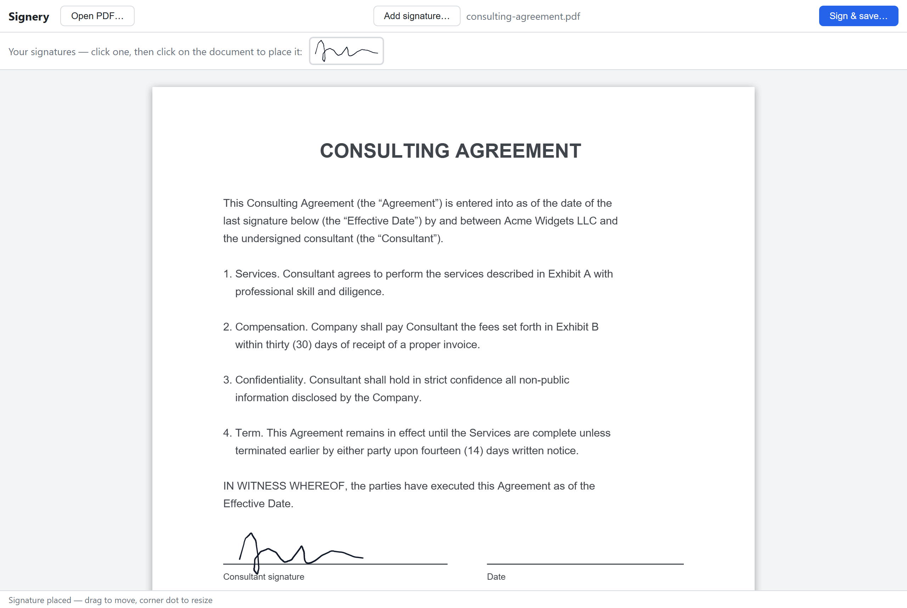
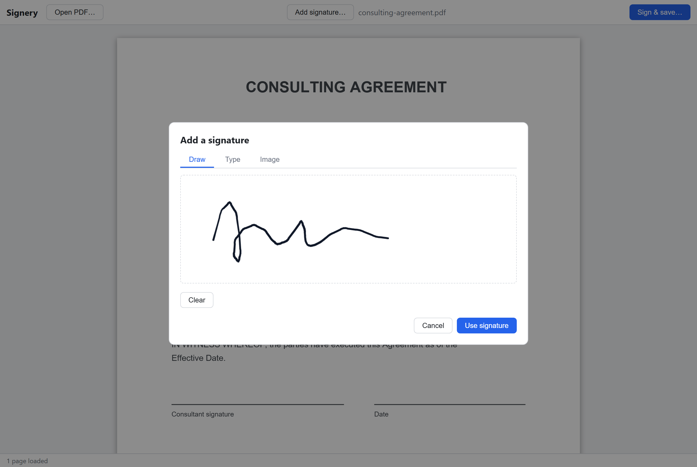
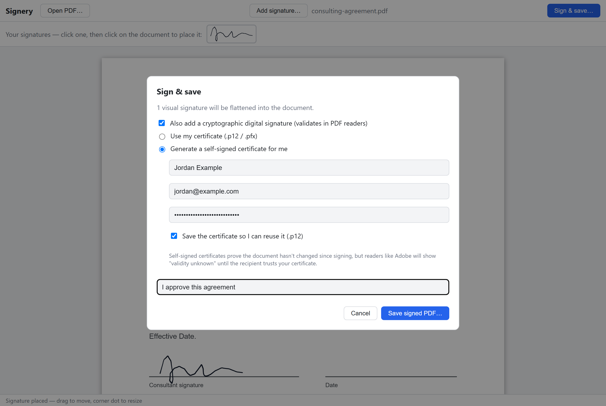
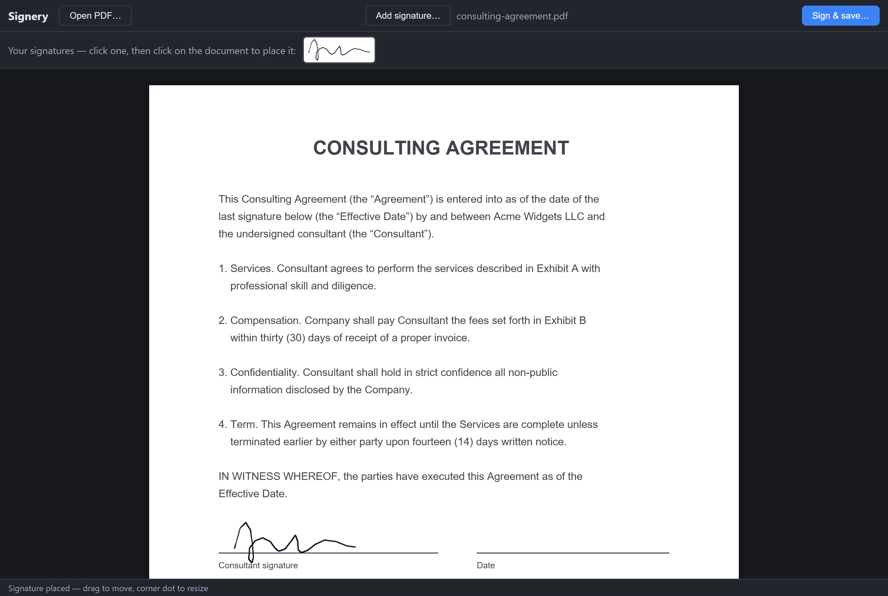

# Signery

**Sign PDFs locally. No servers, no accounts, no uploads.**

Signery is a free, open source, cross-platform desktop app for signing PDF
documents. Everything happens on your machine — your documents and your
private keys never leave it.



| Draw, type, or upload | Optional digital signature | Dark mode |
| --- | --- | --- |
|  |  |  |

## Features

- **Visual signatures** — draw with your mouse/pen, type your name in a
  script font, or use an image of your real signature. Drag to place, resize,
  and stamp it onto any page.
- **Cryptographic digital signatures** — embed a standard PKCS#7
  (`adbe.pkcs7.detached`) signature that PDF readers like Adobe Acrobat
  validate. Use your own certificate (`.p12` / `.pfx`) or let Signery
  generate a self-signed one for you.
- **Fully offline** — no telemetry, no cloud, no subscription. The app is a
  small native shell (Tauri) around a local UI; nothing is ever transmitted.
- **Cross-platform** — Windows, macOS, and Linux.

## A note on self-signed certificates

A digital signature made with a self-signed certificate proves the document
has not been modified since signing, and readers will show *who* signed it —
but Adobe will report "validity unknown" until the recipient chooses to trust
your certificate. That is inherent to self-signed certificates, not a bug.
If you need signatures that validate out of the box, use a certificate issued
by a trusted CA (many countries issue citizen eID certificates that work) and
load it via the "Use my certificate" option.

## Building from source

Prerequisites: [Rust](https://rustup.rs), [Node.js](https://nodejs.org) 20+,
and the [Tauri OS prerequisites](https://tauri.app/start/prerequisites/) for
your platform (WebView2 on Windows, webkit2gtk on Linux).

```sh
npm install
npm run tauri dev      # run in development
npm run tauri build    # produce installers/bundles for your OS
```

## How it works

| Concern | Implementation |
| --- | --- |
| App shell, dialogs, file IO | [Tauri 2](https://tauri.app) (Rust) |
| PDF rendering | [pdf.js](https://mozilla.github.io/pdf.js/) |
| Drawing signatures | [signature_pad](https://github.com/szimek/signature_pad) |
| Stamping visual signatures | [pdf-lib](https://pdf-lib.js.org/) |
| Digital signature (PKCS#7 detached, incremental update) | [@signpdf](https://github.com/vbuch/node-signpdf) |
| Certificate parsing / self-signed generation | [node-forge](https://github.com/digitalbazaar/forge) |

When you save, visual signatures are flattened into the page content first,
then the cryptographic signature (if enabled) is added as an incremental
update so it covers the final document bytes.

The signing pipeline has a headless smoke test that generates a certificate,
signs a PDF, and verifies the resulting CMS structure and digest:

```sh
npm run verify
```

There are also headless UI tests (Playwright, requires
`npx playwright install chromium` once) that drive the real app — open,
draw, place, drag, resize, save — and check that the stamped output PDF has
the signature at the right position, including on rotated pages and pages
with an offset CropBox:

```sh
npm run test:ui
```

## Roadmap

- Port the cryptographic signing from JS to Rust (keys handled outside the webview)
- Visible signature widgets linked to the digital signature
- ECDSA certificate support
- Long-term validation (PAdES-LTV: timestamps, revocation info)
- Rotated-page edge cases and more PDF/A friendliness

Contributions welcome!

## License

[MIT](LICENSE)
